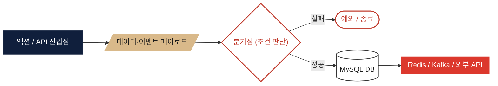

# 도메인별 서비스 플로우

담당 도메인(Mentor, Calendar, Library, Revenue, Exchange, Event, AI Cover)의 핵심 로직을
**실제 Service/Repository 코드를 기준으로** 플로우차트로 정리했습니다.
(`docs/domain.md`, `docs/page-structure.md`의 기획 스펙과 실제 구현이 다른 지점은 각 문서의
"핵심 로직 노트"에 별도로 표기했습니다.)

## 범례 (Legend)

| 도형 | 의미 |
|---|---|
| 남색 사각형 | 액션 / API 진입점 / 상태 전이 |
| 베이지 평행사변형 | 데이터 페이로드, 이벤트, 집계 결과 |
| 빨강 다이아몬드 | 분기점 (조건 검증) |
| 빨강 스타디움 | 예외 발생 / 종료 지점 |
| 흰색 원통 | MySQL 테이블 |
| 빨강 이중테두리 | Redis (캐시·락) / Kafka / 외부 API |

## 도메인 목록

| 도메인 | 문서 | 핵심 기술 포인트 |
|---|---|---|
| 멘토 / 멘토링 | [mentor.md](./mentor.md) | 등급별 자동승인 스코어링, PESSIMISTIC_WRITE 락, 스케줄러 |
| 독서 캘린더 | [calendar.md](./calendar.md) | 순수 MySQL + Java 스트림 집계 (Redis/Querydsl 미사용) |
| 서재 | [library.md](./library.md) | UNIQUE 제약 기반 중복 방지, 배치 조회로 N+1 회피 |
| 정산/출금 (Exchange) | [exchange.md](./exchange.md) | AES-GCM 암호화, Redis SETNX 락 + Lua 락 해제 |
| 수익 통계 (Revenue) | [revenue.md](./revenue.md) | Redis 캐시(TTL 30분/1시간), Querydsl 기간 집계 |
| 이벤트 (선착순 참여) | [event.md](./event.md) | Redisson 분산락(RLock), 트랜잭션 커밋 후 unlock |
| AI 커버 생성 | [ai-cover.md](./ai-cover.md) | Kafka 비동기 Job, Gemini API, S3 업로드, 재시도/환불 |
