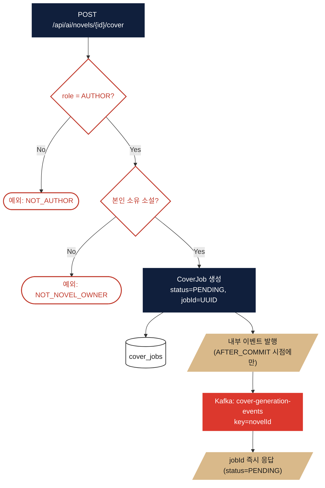
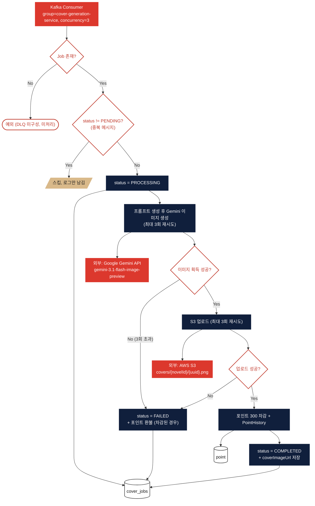
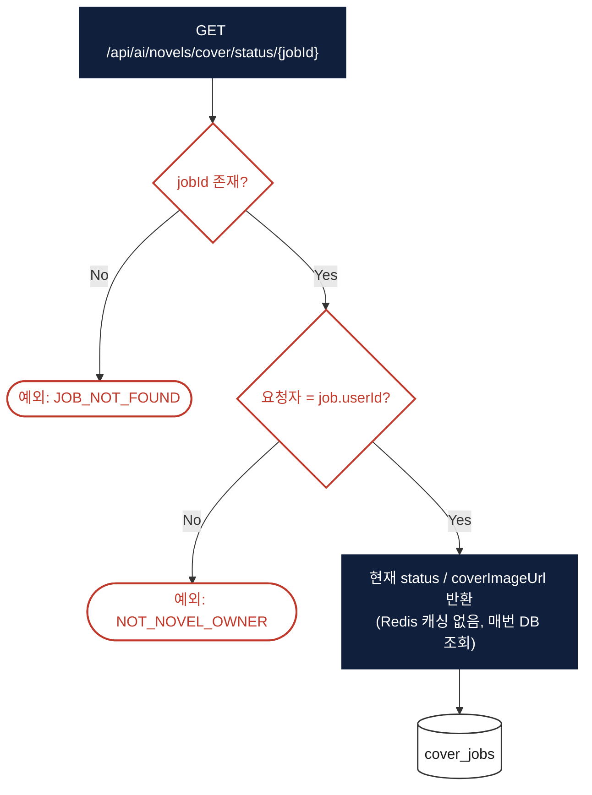

# AI 커버 생성 (Cover AI)

> 대상 코드: `domain/coverai/**`
> 관련 파일: `CoverController`, `CoverService`, `CoverGenerationProducer/Consumer`, `GeminiClient`
> Kafka 토픽: `cover-generation-events` (consumer group: `cover-generation-service`, concurrency=3)

## 서비스 플로우 요약

1. **생성 요청** — 작가 본인 소유 소설인지 확인 후 `CoverJob(PENDING)`을 만들고, DB 트랜잭션이 커밋된 뒤에만 Kafka로 이벤트를 발행합니다. 응답은 `jobId`만 즉시 반환하는 비동기 방식입니다.
2. **비동기 처리(Consumer)** — Gemini 이미지 생성(최대 3회 재시도) → S3 업로드(최대 3회 재시도) → 포인트 300 차감 순으로 진행하며, 어느 단계든 실패하면 Job을 FAILED로 남기고 이미 차감한 포인트를 환불합니다.
3. **상태 폴링** — 클라이언트가 `jobId`로 상태를 주기적으로 조회합니다 (Redis 캐싱 없이 매번 DB 조회).

---

## FLOW A — 커버 생성 요청

## FLOW B — 비동기 처리 (Kafka Consumer)

## FLOW C — 상태 폴링

## 핵심 로직 노트

- **Novel.coverImageUrl은 자동 갱신되지 않음**: Job이 COMPLETED 되어도 `Novel` 엔티티의 커버 URL은 그대로입니다. 클라이언트가 폴링으로 완료를 감지한 뒤 별도로 `PATCH /api/novels/{novelId}/cover`를 호출해야 실제 소설에 반영됩니다 (2단계 커밋 구조).
- **DLQ/재시도 정책 부재**: Kafka 컨슈머 레벨의 재시도(`@RetryableTopic`)나 Dead Letter Topic 설정이 없습니다. Job을 찾지 못하면 예외가 그대로 던져져 메시지가 깔끔하게 처리되지 못하고, Gemini/S3 재시도(각 3회)는 컨슈머 메서드 내부의 로컬 루프일 뿐입니다.
- **포인트 환불 실패는 로그만**: FAILED 처리 시 이미 차감된 포인트를 되돌리는 로직이 있지만, 이 환불 자체가 실패하면 별도 보상 트랜잭션 없이 로그만 남기고 넘어갑니다 (이중 실패 시 정산 불일치 가능성).
- **파티션/컨슈머 동시성**: 토픽 파티션 3개, 컨슈머 concurrency 3으로 병렬 처리하며, 같은 `novelId`를 메시지 키로 사용해 같은 소설의 여러 요청은 같은 파티션에서 순서를 보장합니다.
