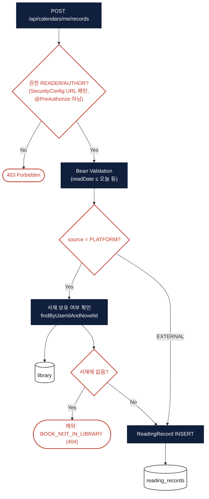
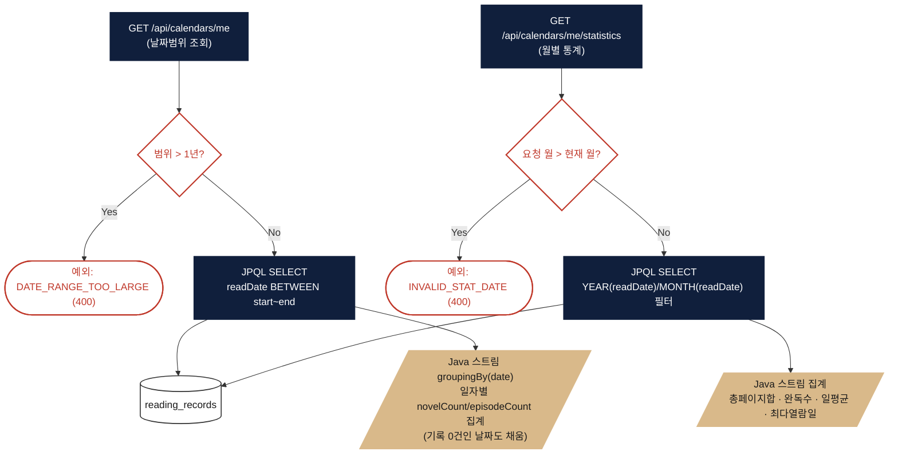

# 독서 캘린더 (Calendar)

> 대상 코드: `domain/calendar/**`
> 관련 파일: `CalendarController`, `CalendarService`, `ReadingRecordRepository`

## 서비스 플로우 요약

1. **독서 기록 추가** — READER/AUTHOR만 접근 가능. 플랫폼 소설(`PLATFORM`)은 서재(Library)에 있는지만 확인하고, 외부 도서(`EXTERNAL`)는 별도 검증 없이 자유 입력을 그대로 저장합니다.
2. **캘린더 뷰 조회** — 날짜 범위(최대 1년)로 기록을 조회한 뒤, SQL이 아닌 **Java 스트림에서 일자별로 그룹핑**하여 응답합니다.
3. **월별 통계** — 해당 월의 기록을 가져와 총 읽은 페이지·완독 수·일평균·최다 열람일을 역시 Java 스트림으로 집계합니다.

---

## FLOW A — 독서 기록 추가

## FLOW B — 캘린더 뷰 & 월별 통계

## 핵심 로직 노트

- **Redis/Querydsl 미사용**: 캘린더 도메인 전체에서 `RedisTemplate`/`@Cacheable`/Querydsl이 전혀 쓰이지 않습니다. 모든 조회는 매 요청마다 MySQL을 직접 읽고 Java에서 집계합니다 — 트래픽이 커지면 가장 먼저 캐싱을 검토해야 할 지점입니다.
- **중복/upsert 검증 없음**: 같은 유저·같은 날짜·같은 소설로 여러 번 기록을 추가해도 막는 로직(유니크 제약, upsert)이 없어 매번 INSERT됩니다.
- **단방향 결합**: Novel/Episode 리포지토리는 전혀 참조하지 않고, `PLATFORM` 소스 검증에 한해 Library 도메인만 읽기 전용으로 참조합니다.
