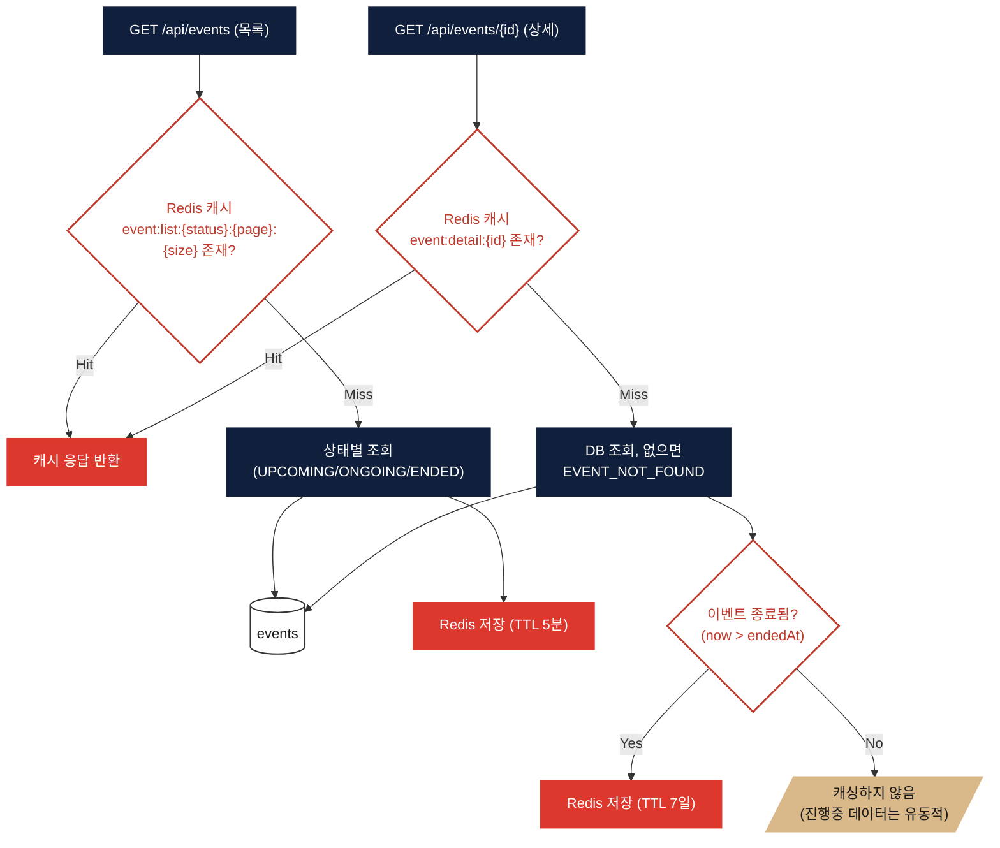
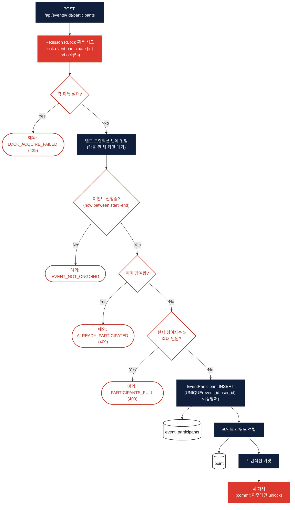

# 이벤트 (Event)

> 대상 코드: `domain/event/**`
> 관련 파일: `UserEventController`, `UserEventService`, `EventParticipateService`, `AdminEventService`

## 서비스 플로우 요약

1. **목록/상세 조회** — 상태별(UPCOMING/ONGOING/ENDED) 목록은 Redis에 5분 캐싱하고, 상세 조회는 **종료된 이벤트에 한해서만** 7일간 캐싱합니다 (진행중 이벤트는 참여자 수가 계속 바뀌므로 캐싱하지 않음).
2. **선착순 참여 신청** — Redisson 분산락(`RLock`)으로 이벤트 단위 동시 요청을 직렬화하고, 락을 쥔 채로 별도 트랜잭션 빈에 위임해 **DB 커밋이 끝난 뒤에만 락을 해제**하도록 만들어 초과 신청(오버셀링)을 막습니다.

---

## FLOW A — 이벤트 목록 / 상세 조회

## FLOW B — 이벤트 참여 신청 (선착순)

## 핵심 로직 노트

- **오버셀링 버그 수정 이력**: README에 기록된 대로, 초기 구현은 트랜잭션 커밋 전에 락을 해제해 정원 100명 이벤트에 101명이 참여 성공하는 문제가 있었습니다. 지금은 참여 로직을 별도 `@Transactional` 빈으로 분리하고, `participate()`가 그 빈의 반환(= 커밋 완료) 이후 `finally`에서 락을 해제하도록 고쳐 해결했습니다. k6 부하테스트(`k6/k6-event-participate.js`, 200 VU 동시 요청)로 검증되어 있습니다.
- **락 방식은 Redisson RLock**: Redis `SETNX`나 Lua 카운터가 아니라 Redisson의 `RLock`을 이벤트별 키(`lock:event:participate:{eventId}`)로 사용합니다. 같은 이벤트에 대한 참여 요청만 직렬화되고, 다른 이벤트끼리는 서로 막지 않습니다.
- **정원 체크는 COUNT 쿼리**: 참여자 수 제한은 Redis 카운터가 아니라 매 요청마다 `COUNT(*) FROM event_participants WHERE event_id=?`로 확인합니다 — 분산락이 이 카운트-후-삽입 구간 전체를 감싸고 있어 안전합니다.
- **status는 저장 필드가 아니라 계산값**: `EventStatus`(UPCOMING/ONGOING/ENDED)는 DB에 저장된 상태 컬럼이 아니라 `startedAt`/`endedAt` 타임스탬프로부터 매번 계산됩니다.
