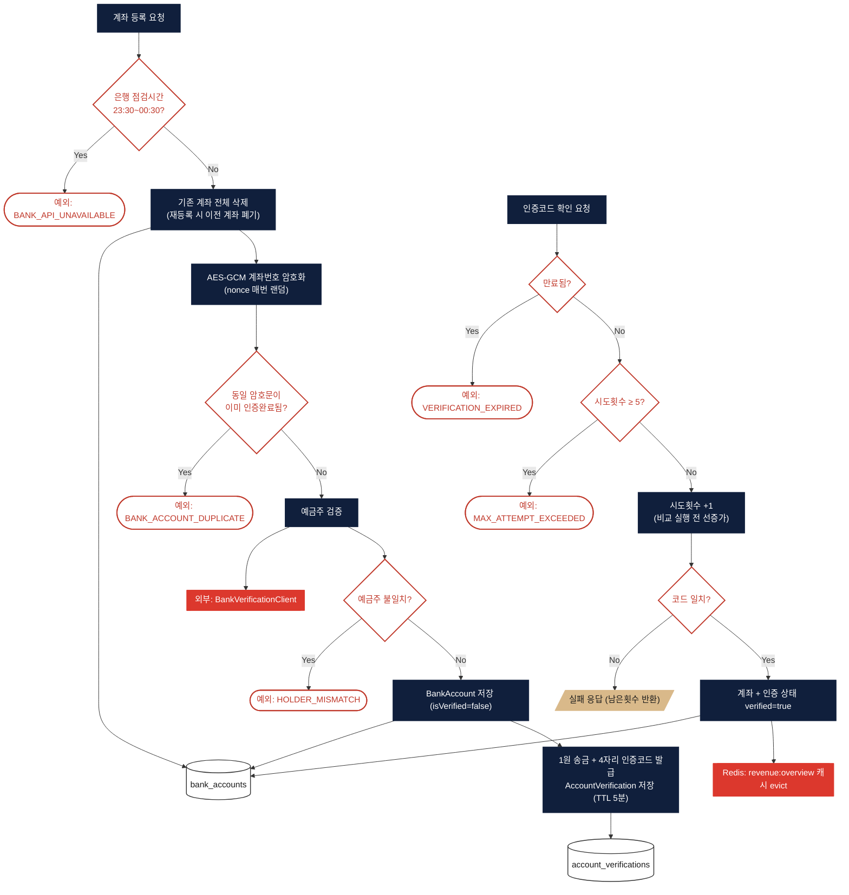
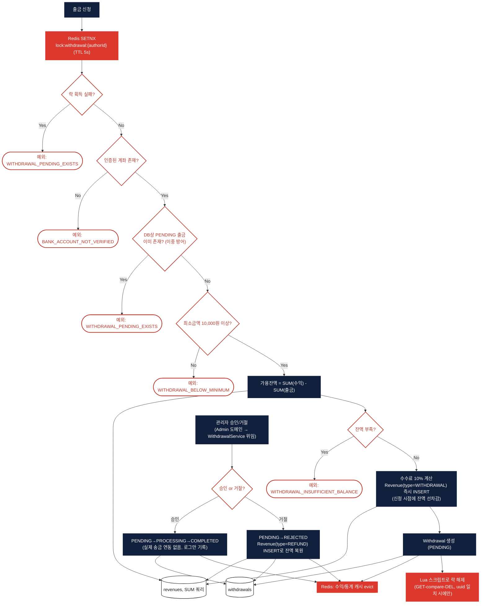

# 정산 / 출금 (Exchange)

> 대상 코드: `domain/exchange/**` (BankAccount, Withdrawal — 수익 통계는 [revenue.md](./revenue.md) 참고)
> 관련 파일: `BankAccountService`, `WithdrawalService`, `AesEncryptionUtil`, `LocalBankVerificationClient`

## 서비스 플로우 요약

1. **계좌 등록 + 1원 인증** — 계좌번호는 AES-GCM으로 암호화해 저장하고, 1원 송금 코드를 발급해 5분 내 5회 이내로 인증해야 활성화됩니다.
2. **출금 신청** — Redis 락으로 동시 중복신청을 막고, `revenues` 테이블의 수익 합계에서 이미 출금한 금액을 뺀 값으로 가용 잔액을 계산합니다. **신청 시점에 즉시 잔액이 차감**됩니다.
3. **관리자 승인/거절** — Admin 도메인이 `WithdrawalService`에 위임하는 구조로, 승인 시 실제 송금 연동 없이 상태만 COMPLETED로 바뀌고, 거절 시 차감된 잔액이 환불(REFUND) 레코드로 복원됩니다.

---

## FLOW A — 계좌 등록 + 1원 인증

## FLOW B — 출금 신청 & 승인/거절

## 핵심 로직 노트

- **Redis 락은 Redisson이 아닌 순수 SETNX**: `domain/exchange`에는 Redisson 의존성이 없고, `redisTemplate.opsForValue().setIfAbsent(...)` + Lua 스크립트(GET-compare-DEL)로 직접 분산락을 구현했습니다. DB 유니크 조건(`existsByAuthorIdAndStatus`)이 이중 안전장치로 붙어 있습니다.
- **잔액은 신청 시점에 선차감**: 출금 승인 대기(PENDING) 상태에서도 이미 `Revenue(WITHDRAWAL)` 레코드가 잔액에서 빠져 있으므로, `정산 개요(가용 잔액)`는 승인 전부터 줄어들어 보입니다. 거절 시에만 `REFUND` 레코드로 복원됩니다.
- **실제 은행 송금 연동 없음**: 관리자가 "승인"을 누르면 바로 PROCESSING→COMPLETED로 전이되며, 실제 은행 API 호출은 없고 로그만 남습니다 (주석상 "실제 송금 처리(현재는 로그만 기록)").
- **1원 인증 코드도 실제 발송되지 않음**: `LocalBankVerificationClient`는 로컬/개발 환경용 목(mock)으로, 인증코드를 사용자에게 실제로 전달하지 않고 서버 로그에만 남깁니다. 은행 점검시간(23:30~00:30) 시뮬레이션도 이 목 클라이언트에 하드코딩되어 있습니다.
