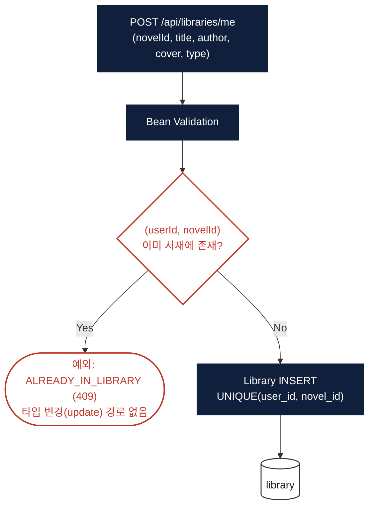
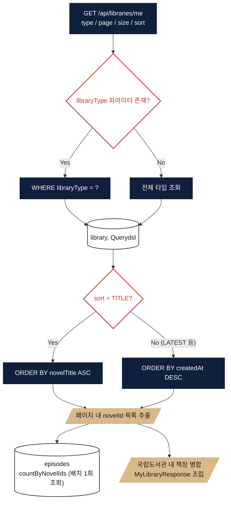

# 서재 (Library)

> 대상 코드: `domain/library/**`
> 관련 파일: `LibraryController`, `LibraryService`, `LibraryQueryRepository`

## 서비스 플로우 요약

1. **서재에 소설 추가** — 클라이언트가 소설 정보(제목·작가명·커버 URL)를 스냅샷으로 함께 보내면, `(userId, novelId)` 유니크 제약으로 중복만 막고 그대로 저장합니다. 소설 실존 여부는 검증하지 않습니다.
2. **내 서재 목록 조회** — 타입 필터(READING/BOOKMARK/COMPLETED/PURCHASED) + 페이징 + 정렬(TITLE/LATEST)로 조회하며, 회차 수는 N+1을 피하기 위해 배치 조회합니다.

---

## FLOW A — 서재에 소설 추가

## FLOW B — 내 서재 목록 조회

## 핵심 로직 노트

- **PURCHASED 타입은 자동 연동되지 않음**: `domain.md`상으로는 `PURCHASED`가 "구매한 작품"을 뜻하지만, 실제로는 결제(Payment)·구매(Purchases) 도메인 어디에서도 구매 완료 후 서재에 자동으로 `PURCHASED` 항목을 추가하는 코드가 없습니다. 4가지 타입 모두 클라이언트가 직접 지정해서 보내는 값일 뿐입니다 — 결제 완료 이벤트를 구독해 자동 반영하는 로직 추가가 필요할 수 있는 지점입니다.
- **타입 변경 불가**: `(userId, novelId)` 조합이 유니크 제약이라, 같은 소설을 다른 타입(예: BOOKMARK → READING)으로 바꾸려면 새로 추가가 아니라 별도의 update API가 필요한데, 현재 `Library.changeType()` 메서드는 정의만 있고 호출하는 곳이 없습니다.
- **소설 실존성 미검증**: `LibraryService`는 `NovelRepository`를 의존하지 않아 존재하지 않는 `novelId`로도 추가가 가능합니다.
- **Redis 미사용**: 서재 도메인 자체는 캐싱하지 않으며, Calendar/추천AI 도메인이 읽기 전용으로 `LibraryRepository`를 참조합니다.
