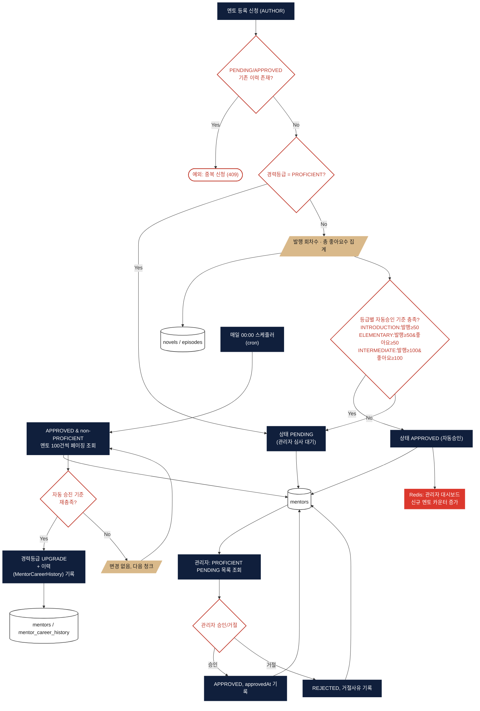
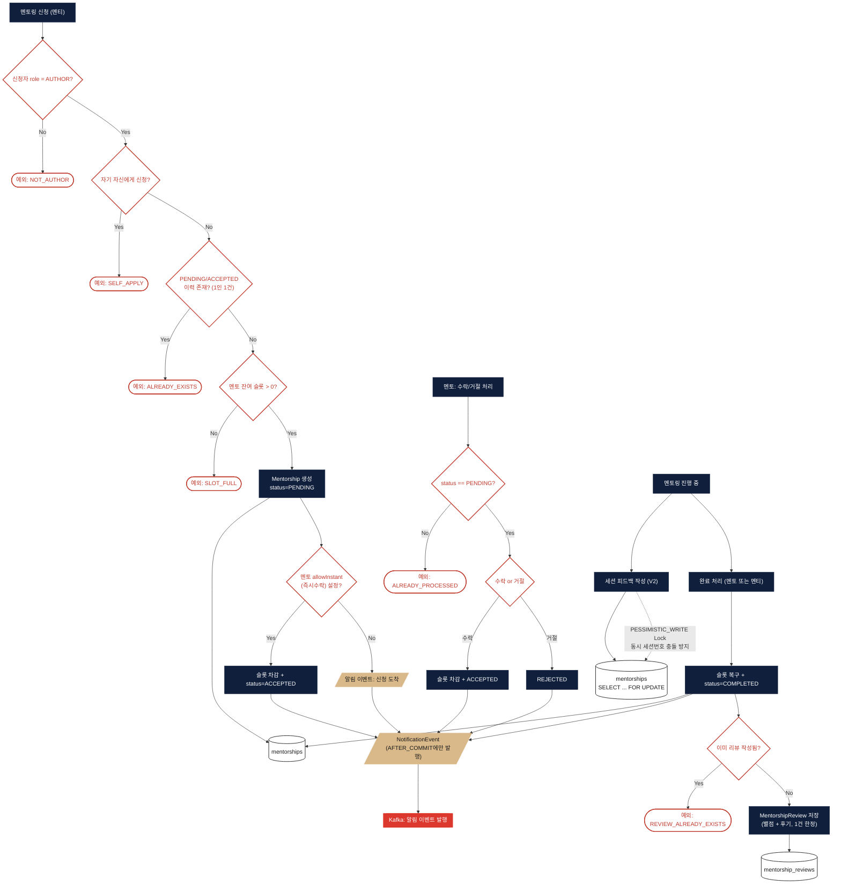

# 멘토 / 멘토링 (Mentor)

> 대상 코드: `domain/mentor/**`, `domain/mentoring/**`
> 관련 파일: `MentorService`, `MentorCareerLevelScheduler`, `MentorshipService`, `MentoringService`, `MentorshipReviewService`

## 서비스 플로우 요약

1. **멘토 등록 신청** — AUTHOR가 경력등급·주력장르·전문분야 등을 입력해 신청하면, 경력등급별 기준(발행 회차 수·좋아요 수)을 충족할 경우 **자동 승인**되고, 미충족이거나 최고 등급(PROFICIENT)이면 관리자 심사 대기(PENDING) 상태가 됩니다.
2. **경력등급 자동 승급** — 매일 자정 스케줄러가 APPROVED 멘토를 순회하며 활동 지표를 재계산해 등급을 자동으로 올려줍니다.
3. **멘토링 신청** — 멘티가 멘토를 지정해 신청하면 멘토의 "즉시수락" 설정에 따라 바로 ACCEPTED 되거나 PENDING 상태로 멘토의 응답을 기다립니다.
4. **진행 · 피드백 · 완료** — 멘토가 세션 피드백을 남기고, 완료 처리 시 멘토의 멘티 슬롯이 반환되며, 멘티는 완료된 건에 한해 1회 만족도 평가를 남길 수 있습니다.

---

## FLOW A — 멘토 등록 신청 & 승인

## FLOW B — 멘토링 신청 → 진행 → 완료

## 핵심 로직 노트

- **자동승인 스코어링**: 신청 시 `resolveInitialStatus()`가 경력등급별 임계치(발행 회차 수·좋아요 수)를 즉시 계산해 PENDING/APPROVED를 결정합니다. PROFICIENT 등급만 무조건 관리자 심사로 넘어갑니다.
- **관리자 승인 시 역할 변경 없음**: `Mentor.approve()`는 `Mentor` 엔티티 상태만 APPROVED로 바꿀 뿐, `User.role`을 MENTOR로 바꾸는 로직은 어디에도 없습니다 (코드상 `changeRole` 메서드는 정의만 되어 있고 호출되지 않음).
- **채팅방 자동 생성 없음**: `page-structure.md`에는 "ACCEPTED → 채팅 바로가기"라고 되어 있지만, 실제로는 멘토링 수락/승인 로직에서 `ChatRoom`을 생성하는 코드가 없습니다. 채팅방은 별도 도메인에서 독립적으로 다뤄집니다.
- **동시성 제어는 피드백 V2에만 존재**: 두 도메인 전체에서 유일한 락은 `MentorshipRepository.findByIdWithLock` (PESSIMISTIC_WRITE) 하나이며, 세션 번호 중복을 막기 위한 용도입니다. Redisson/분산락은 사용하지 않습니다.
- **낙관적 락**: `Mentor` 엔티티에는 `@Version` 필드가 있어 슬롯 증감(`decreaseSlot`/`increaseSlot`) 시 낙관적 락으로 동시성을 방지하지만, `Mentorship` 엔티티에는 없습니다.
