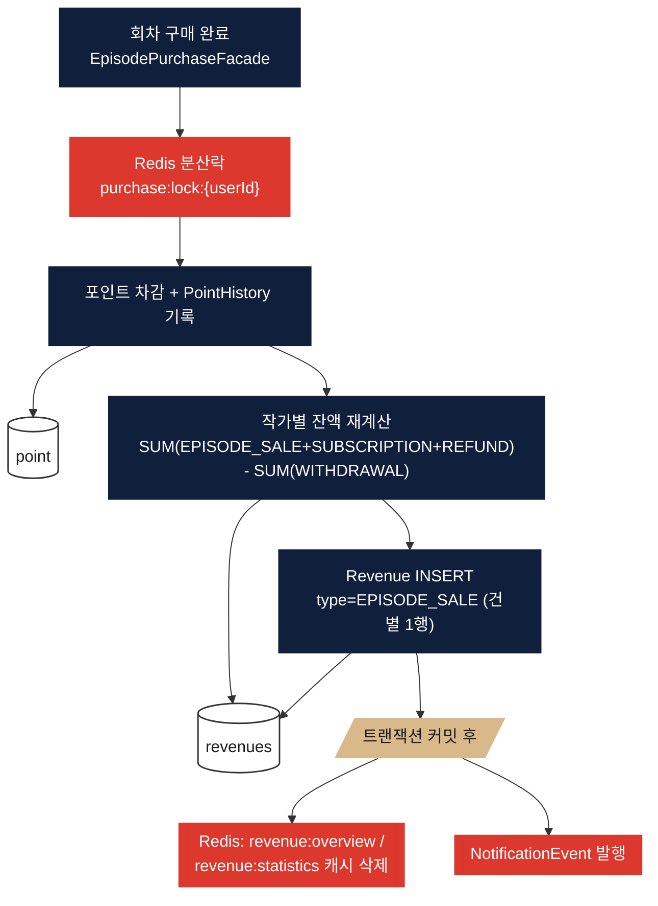
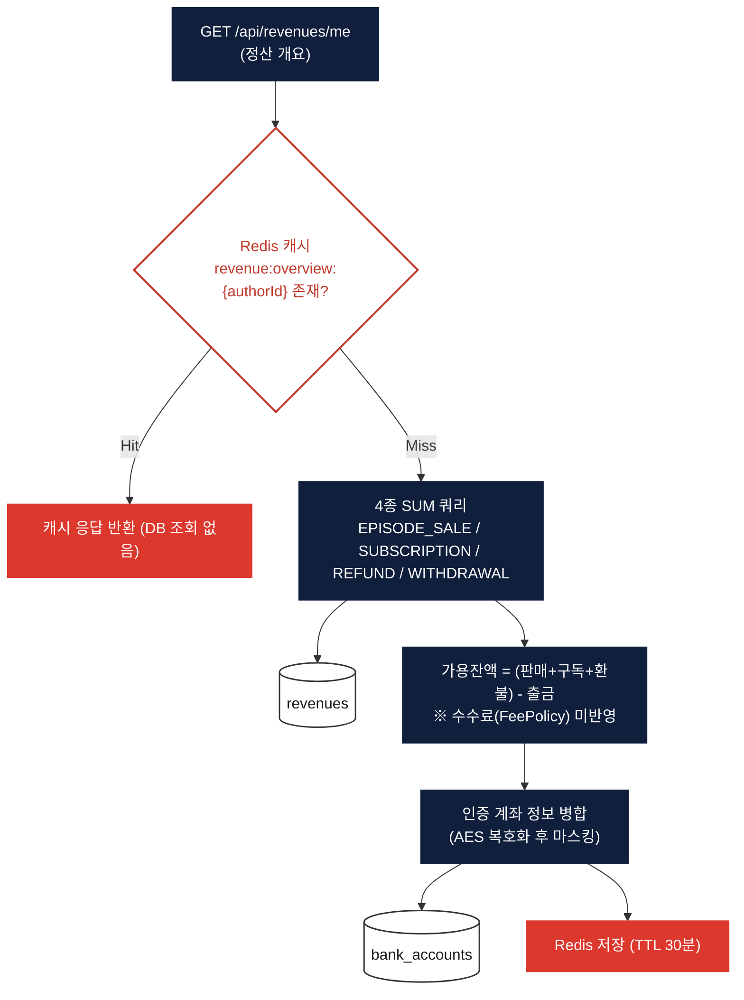
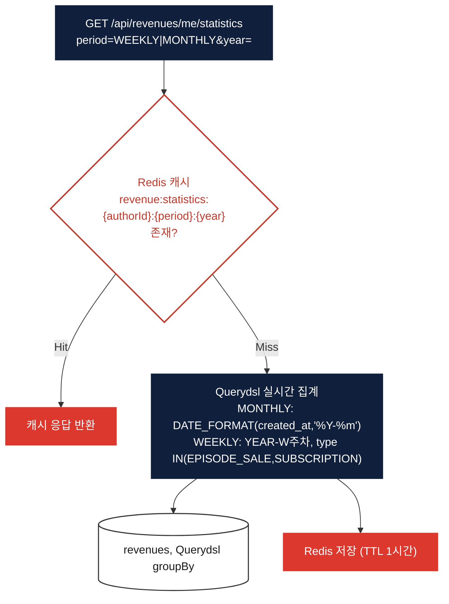

# 수익 통계 (Revenue)

> 대상 코드: `domain/exchange/controller/RevenueController.java`, `service/RevenueService.java`, `service/StatisticsService.java`, `entity/Revenue.java`
> (계좌/출금 흐름은 [exchange.md](./exchange.md) 참고)

## 서비스 플로우 요약

1. **수익 발생** — 회차 구매가 완료되는 순간, 결제 트랜잭션과 **같은 트랜잭션 안에서** 작가별 `Revenue(EPISODE_SALE)` 레코드가 즉시 생성됩니다. 별도의 배치·이벤트 집계가 아닙니다.
2. **정산 개요 조회** — `총 수익 - 총 출금액`으로 가용 잔액을 계산하며, Redis에 30분 캐싱됩니다.
3. **기간별 통계** — WEEKLY/MONTHLY 단위로 Querydsl 집계 쿼리를 매 요청 실시간 실행하고, 결과를 1시간 캐싱합니다.

---

## FLOW A — 수익 발생 시점

## FLOW B — 정산 개요 조회

## FLOW C — 기간별 수익 통계 조회

## 핵심 로직 노트

- **SUBSCRIPTION 수익은 죽은 코드**: `RevenueType.SUBSCRIPTION`은 모든 합산/통계 쿼리에 포함되어 있지만, 실제로 이 타입의 `Revenue` 행을 생성하는 코드가 리포지토리 전체에 없습니다. 즉 현재 구독 수익은 항상 0으로 집계됩니다 — 구독 결제 완료 시 `RevenueService`를 호출하는 연동이 누락된 상태입니다.
- **정산 개요엔 수수료 미반영**: `RevenueOverviewResponse`의 가용 잔액은 수수료를 빼지 않은 순수 차액이며, `FeePolicy`(10% 수수료)는 실제로 출금을 신청할 때(`WithdrawalService`)만 적용됩니다. 따라서 정산 개요에 보이는 "출금 가능 금액"과 실제 입금액(actualAmount)에는 차이가 있습니다.
- **캐시 무효화 지점**: 회차 구매, 출금 신청/승인/거절 — 이 세 시점에서만 `revenue:overview`, `revenue:statistics:*` 캐시가 evict됩니다. 새로운 수익 발생 트리거를 추가할 때(예: 구독) 캐시 무효화도 같이 잊지 않아야 합니다.
- **통계는 배치가 아닌 실시간 집계**: 미리 집계해두는 테이블 없이 매 캐시-미스마다 Querydsl로 `revenues` 테이블을 직접 그룹핑합니다. 데이터가 커지면 이 지점이 성능 병목이 될 수 있습니다.
